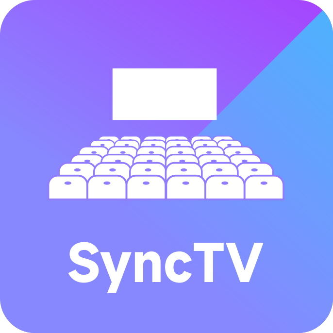
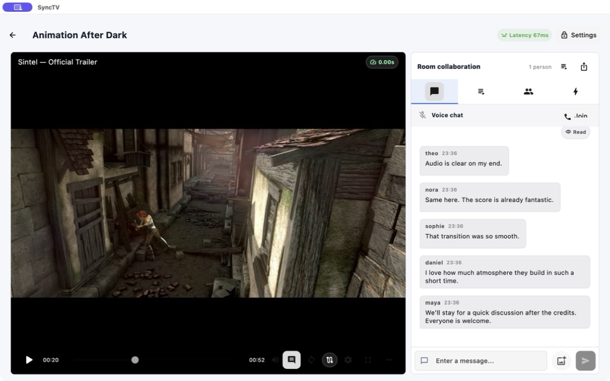

<!-- markdownlint-disable MD013 MD033 MD041 -->

<p align="center">
  
</p>

# SyncTV

[简体中文](./README.zh-CN.md) · [Website](https://syncs.tv)


SyncTV is a Rust implementation of a real-time synchronized video watching platform with media provider integration, livestreaming, HTTP/gRPC APIs, and Kubernetes-ready horizontal scaling.

<p align="center">
  
</p>

## Highlights

- Synchronized room playback with real-time state updates.
- Media providers for Bilibili, Twitch, YouTube, Douyin, TikTok, Huya, Douyu, AcFun, CCTV, Alist, Cloudreve, Emby/Jellyfin, FNOS, QNAP, Synology, Nextcloud, Seafile, TrueNAS, direct URLs, and livestream sources.
- RTMP push/pull, HLS, and HTTP-FLV livestream support.
- RTSP external pull with TCP/UDP transport and live HLS/HTTP-FLV remuxing.
- HTTP REST, public gRPC, WebSocket, management gRPC, metrics, RTMP, and STUN runtime surfaces.
- PostgreSQL-backed durable storage with optional Redis shared state, cache, rate limiting, and cluster coordination.
- Docker Compose and Helm deployment templates.
- Built-in management CLI and optional OpenAPI/Swagger UI.
- Astro Starlight documentation site with English and Simplified Chinese content.

## Discussion and Contributors

Join the [SyncTV Telegram discussion](https://t.me/synctv) to talk with users and contributors about deployment, operations, media providers, client development, and the product roadmap.


## Quick Start

Development environment from a full repository checkout:

```bash
# Starts PostgreSQL and Redis, then runs SyncTV locally with development settings.
make dev-serve

# Starts optional media/auth/storage dependencies too.
make dev-stack

# Runs real CLI/curl provider smoke tests through the Makefile dev startup path.
make dev-smoke
```

Production Compose uses generated PostgreSQL, Redis, and application secrets:

```bash
# Requires Docker Compose and openssl.
make compose-init

# Edit SYNCTV_BOOTSTRAP_ROOT_PASSWORD in .env.synctv before starting.
make compose-up
```

Validate configuration:

```bash
cargo +nightly run -p synctv --bin synctv -- config validate
```

Optional migration preflight. The server also runs embedded SQLx migrations automatically during startup:

```bash
cargo +nightly run -p synctv --bin synctv -- db migrate
```

Start locally:

```bash
cargo +nightly run -p synctv --bin synctv -- serve
```

### Embedded Web client

The optional `web-ui` feature embeds a Flutter Web distribution in the HTTP
server. The browser client always uses the page origin, so one deployed Web UI
belongs to one SyncTV server. Build the app and server together from sibling
checkouts:

```bash
make web-release-build SYNCTV_APP_DIR=/path/to/synctv-app
```

The target builds Flutter without runtime CDN resources, then compiles the
release server with `SYNCTV_WEB_DIST` and the `web-ui` feature. The server
provides SPA fallback, content types, ETags, Brotli/gzip variants, cache policy,
CSP, and the OAuth/provider-verification callback pages. API and media routes
remain outside the application-shell cache.

Keep the app and server protobuf snapshots aligned. Browser playback sends a
versioned `PlaybackClientProfile`; Providers use it with the configured proxy
policy to select direct or proxy routes before returning playback output.

## Documentation

Read the complete documentation at [docs.syncs.tv](https://docs.syncs.tv).

Download the native client from the [client downloads guide](https://docs.syncs.tv/install/downloads/) or [SyncTV App releases](https://github.com/synctv-org/synctv-app/releases/latest). Store builds are distributed through the supported app stores.

## License

MIT. See [LICENSE](./LICENSE).
